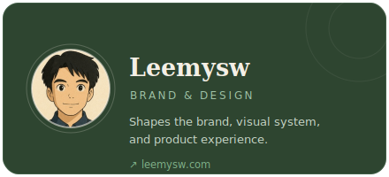
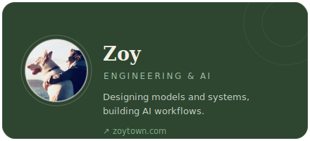

<!--
  zuuzii — GitHub Organization Profile README (English, default)
  MUST live at:  .github/profile/README.md  (PUBLIC repo ".github", DEFAULT branch)
  Renders at the top of  https://github.com/zuuzii-org
  Chinese version: profile/README.zh.md
  HTML allowlist only: div(align), picture/source/img, table/tr/td, a, strong/em, br, hr, sub, details/summary.
-->

**English**　·　[中文](https://github.com/zuuzii-org/.github/blob/main/profile/README.zh.md)

<picture>
  <source media="(prefers-color-scheme: dark)" srcset="./assets/banner-dark.svg">
  
</picture>

---

**zuuzii is an AI product studio.** We turn AI into focused tools, apps, and experiences for everyday life — vast in scope, exact in detail.

## Products

> Six products live today — a tools directory, two desktop/mobile apps, a developer gateway, an image studio, and AI companions on WeChat.

<table>
<tr>
<td width="50%" valign="top">

### 🧭 [AI Tools Library](https://aihunter.zuuzii.com)

 

**Fresh AI tools, hand-picked daily.**

- Daily-updated picks — no endless scrolling
- Sorted by use case: writing, image, code, audio…
- A weekly board of what's actually trending

**Good for** · keeping up with AI without doomscrolling

[Learn more →](https://github.com/zuuzii-org/.github/blob/main/profile/products/aihunter.md)

</td>
<td width="50%" valign="top">

### 📖 [MuseView](https://zuuzii.com/productions/museview/)

 

**Local-first reader for Markdown & HTML.**

- Reads Markdown & HTML; your files stay on-device
- Live preview with inline editing
- Export clean PDFs · AI summaries on demand

**Good for** · heavy readers, note-takers, researchers

[Learn more →](https://github.com/zuuzii-org/.github/blob/main/profile/products/museview.md)

</td>
</tr>
<tr>
<td width="50%" valign="top">

### 🤖 [AgentStudio](https://zuuzii.com/productions/agentstudio/)

 

**Describe it, two agents build it.**

- No code — just say what you want
- Two agents: one plans, one builds & self-checks
- Runs locally on macOS until the result works

**Good for** · turning ideas into working tools

[Learn more →](https://github.com/zuuzii-org/.github/blob/main/profile/products/agentstudio.md)

</td>
<td width="50%" valign="top">

### 🔀 [Token Share](https://zuuzii.com/productions/token-share/)

 

**Local gateway — any client, any model.**

- One local endpoint for every LLM client
- Translates OpenAI ↔ Anthropic protocols live
- Streaming, fully local — keys never leave your machine

**Good for** · developers juggling multiple models

[Learn more →](https://github.com/zuuzii-org/.github/blob/main/profile/products/token-share.md)

</td>
</tr>
<tr>
<td width="50%" valign="top">

### 🎨 [AI Warmup](https://zuuzii.com/productions/ai-warmup/)

 

**Upload a photo, let AI reimagine it.**

- Restyle, edit, restore, and repaint any image
- Point-metered, generated on the spot
- Browser-based — nothing to install

**Good for** · quick image creation & restoration

[Learn more →](https://github.com/zuuzii-org/.github/blob/main/profile/products/ai-warmup.md)

</td>
<td width="50%" valign="top">

### 💬 [AI Companions](https://zuuzii.com/productions/chatbot/)

 

**Pick a persona, scan, chat on WeChat.**

- 50+ personas, each with its own character
- Scan a QR code to add it — no app to download
- Remembers context, so chats feel continuous

**Good for** · a bit of company, right inside WeChat

[Learn more →](https://github.com/zuuzii-org/.github/blob/main/profile/products/chatbot.md)

</td>
</tr>
<tr>
<td width="50%" valign="top">

### 🪄 [WonderInk](https://apps.apple.com/app/id6779648706)

 

**Restyle, doodle, animate — four AI tools in your pocket.**

- Restyle a portrait in 12 art styles
- Doodle a few strokes → AI finishes the art
- Bring a photo to life as a 5-second video

**Good for** · turning photos & sketches into AI art on iPhone

[Learn more →](https://github.com/zuuzii-org/.github/blob/main/profile/products/wonderink.md)

</td>
</tr>
</table>

---

## About

Attention is easy to raise; depth is harder to make.
 
zuuzii serves not only work, but imagination too — refining every product and experience at depth.

---

## Team

&nbsp;&nbsp;

---

 &nbsp;

© 2026 zuuzii · Built in the AI era

