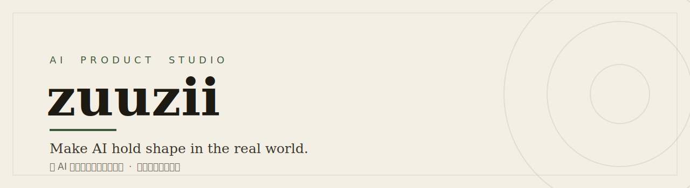

<!--
  zuuzii — GitHub Organization Profile README
  ───────────────────────────────────────────
  MUST live at:  .github/profile/README.md  (PUBLIC repo ".github", DEFAULT branch)
  Renders at the top of  https://github.com/zuuzii-org
  A root README.md will NOT work — it must be inside profile/.

  HTML stays inside GitHub's allowlist: div(align), picture/source/img, table/tr/td,
  a, strong/em, br, hr, sub, details/summary. No <style>, class, id, inline style, <script>.

  Banner + thumbnails live under profile/assets/. Relative ./assets/x resolves to
  profile/assets/x. Hosted equivalent: raw.githubusercontent.com/zuuzii-org/.github/main/profile/assets/x
-->

<picture>
  <source media="(prefers-color-scheme: dark)" srcset="./assets/banner-dark.svg">
  
</picture>

---

**zuuzii is an AI product studio.** We turn AI into focused tools, apps, and experiences for everyday life — vast in scope, exact in detail.
 
zuuzii 是一家 AI 产品工作室。我们把 AI 做成日常可用的工具、应用与体验 —— 致广大而尽精微。

## Products · 产品

> Six products live today — a tools directory, two desktop/mobile apps, a developer gateway, an image studio, and AI companions on WeChat.
>  六款已上线产品:工具导航 · 两款桌面/移动应用 · 开发者网关 · 图像创作台 · 微信 AI 陪聊。

<table>
<tr>
<td width="50%" valign="top">

### 🧭 [AI Tools Library](https://aihunter.zuuzii.com)

 

**Fresh AI tools, hand-picked daily.**
 每天精选，值得一试的 AI 工具

- Daily-updated picks — no endless scrolling
- Sorted by use case: writing, image, code, audio…
- A weekly board of what's actually trending

**Good for** · 不刷信息流，也能发现真正好用的 AI 工具

[Open AI Tools Library →](https://aihunter.zuuzii.com)

</td>
<td width="50%" valign="top">

### 📖 [MuseView](https://zuuzii.com/productions/museview/)

 

**Local-first reader for Markdown & HTML.**
 本地优先的文档阅读器，读写导出更顺手

- Reads Markdown & HTML; your files stay on-device
- Live preview with inline editing
- Export clean PDFs · AI summaries on demand

**Good for** · 重度阅读者、笔记党、研究者

[Open MuseView →](https://zuuzii.com/productions/museview/)

</td>
</tr>
<tr>
<td width="50%" valign="top">

### 🤖 [AgentStudio](https://zuuzii.com/productions/agentstudio/)

 

**Describe it, two agents build it.**
 动动嘴，双 AI 把想法做成成品

- No code — just say what you want
- Two agents: one plans, one builds & self-checks
- Runs locally on macOS until the result works

**Good for** · 把脑子里的点子变成能用的小工具

[Open AgentStudio →](https://zuuzii.com/productions/agentstudio/)

</td>
<td width="50%" valign="top">

### 🔀 [Token Share](https://zuuzii.com/productions/token-share/)

 

**Local gateway — any client, any model.**
 本地 LLM 网关，任意客户端接任意模型

- One local endpoint for every LLM client
- Translates OpenAI ↔ Anthropic protocols live
- Streaming, fully local — keys never leave your machine

**Good for** · 在多模型、多客户端之间自由切换的开发者

[Open Token Share →](https://zuuzii.com/productions/token-share/)

</td>
</tr>
<tr>
<td width="50%" valign="top">

### 🎨 [AI Warmup](https://zuuzii.com/productions/ai-warmup/)

 

**Upload a photo, let AI reimagine it.**
 上传一张图，AI 帮你重绘与修复

- Restyle, edit, restore, and repaint any image
- Point-metered, generated on the spot
- Browser-based — nothing to install

**Good for** · 快速出图、人像重绘、老照片修复

[Open AI Warmup →](https://zuuzii.com/productions/ai-warmup/)

</td>
<td width="50%" valign="top">

### 💬 [AI Companions](https://zuuzii.com/productions/chatbot/)

 

**Pick a persona, scan, chat on WeChat.**
 挑个人设，扫码就能在微信里聊

- 50+ personas, each with its own character
- Scan a QR code to add it — no app to download
- Remembers context, so chats feel continuous

**Good for** · 微信里随时找个人陪你聊两句

[Open AI Companions →](https://zuuzii.com/productions/chatbot/)

</td>
</tr>
</table>

---

## About · 理念

Attention is easy to raise; depth is harder to make.
 
zuuzii serves not only work, but imagination too — refining every product and experience at depth.
 
声名易起，深意难成。zuuzii 不只服务工作，也服务想象，在深处打磨每一个产品和体验。

---

## Team

<table>
<tr>
<td width="50%" align="center" valign="top">

**[Leemysw](https://leemysw.com/)**
 
Brand & Design
 品牌 · 视觉 · 体验

</td>
<td width="50%" align="center" valign="top">

**[Zoy](https://www.zoytown.com)**
 
Engineering & AI
 模型 · 系统 · 工作流

</td>
</tr>
</table>

---

 &nbsp;

© 2026 zuuzii · Built in the AI era

