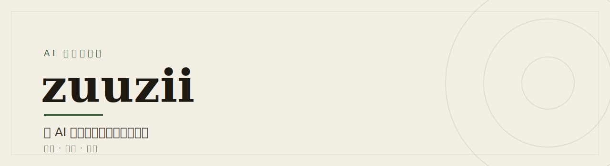
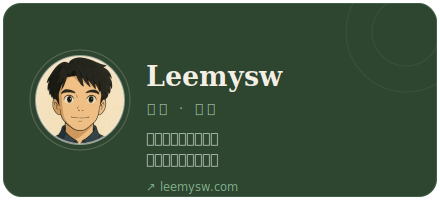
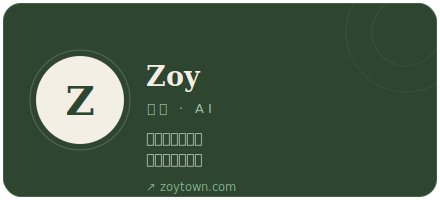

<!--
  zuuzii — 组织主页 README（中文版）
  英文默认版在 profile/README.md；本文件经顶部「中文」链接到达。
  仅用 GitHub 允许的 HTML：div(align)/picture/source/img/table/tr/td/a/strong/em/br/hr/sub/details/summary。
-->

[English](https://github.com/zuuzii-org/.github/blob/main/profile/README.md)　·　**中文**

<picture>
  <source media="(prefers-color-scheme: dark)" srcset="./assets/banner-zh-dark.svg">
  
</picture>

---

**zuuzii 是一家 AI 产品工作室。** 我们把 AI 做成日常可用的工具、应用与体验 —— 致广大而尽精微。

## 产品

> 六款已上线产品:工具导航 · 两款桌面/移动应用 · 开发者网关 · 图像创作台 · 微信 AI 陪聊。

<table>
<tr>
<td width="50%" valign="top">

### 🧭 [AI 工具库](https://aihunter.zuuzii.com)

 

**每天精选，值得一试的 AI 工具。**

- 每天更新精选 —— 不用刷信息流
- 按场景归类:写作、图像、代码、音频…
- 每周一版「正在火」的榜单

**适合** · 不刷信息流也能跟上 AI

[了解更多 →](https://github.com/zuuzii-org/.github/blob/main/profile/products/aihunter.zh.md)

</td>
<td width="50%" valign="top">

### 📖 [MuseView](https://zuuzii.com/productions/museview/)

 

**本地优先的 Markdown / HTML 阅读器。**

- 读 Markdown 与 HTML，文件留在本机
- 实时预览 + 就地编辑
- 导出干净 PDF · AI 摘要按需启用

**适合** · 重度阅读者、笔记党、研究者

[了解更多 →](https://github.com/zuuzii-org/.github/blob/main/profile/products/museview.zh.md)

</td>
</tr>
<tr>
<td width="50%" valign="top">

### 🤖 [AgentStudio](https://zuuzii.com/productions/agentstudio/)

 

**动动嘴，双 AI 把想法做成成品。**

- 不用写代码 —— 说出你想要什么
- 两个 AI:一个规划，一个动手并自检
- 本地 macOS 运行，直到做出能用的东西

**适合** · 把点子变成能用的小工具

[了解更多 →](https://github.com/zuuzii-org/.github/blob/main/profile/products/agentstudio.zh.md)

</td>
<td width="50%" valign="top">

### 🔀 [Token Share](https://zuuzii.com/productions/token-share/)

 

**本地网关 —— 任意客户端接任意模型。**

- 一个本地地址，接所有 LLM 客户端
- 实时互译 OpenAI ↔ Anthropic 协议
- 支持流式、纯本地 —— key 不出本机

**适合** · 在多模型间自由切换的开发者

[了解更多 →](https://github.com/zuuzii-org/.github/blob/main/profile/products/token-share.zh.md)

</td>
</tr>
<tr>
<td width="50%" valign="top">

### 🎨 [AI Warmup](https://zuuzii.com/productions/ai-warmup/)

 

**上传一张图，AI 帮你重绘与修复。**

- 重绘、编辑、修复、作画，一张图搞定
- 按积分计费、即时生成
- 浏览器直接用 —— 无需安装

**适合** · 快速出图、人像重绘、老照片修复

[了解更多 →](https://github.com/zuuzii-org/.github/blob/main/profile/products/ai-warmup.zh.md)

</td>
<td width="50%" valign="top">

### 💬 [AI 好友](https://zuuzii.com/productions/chatbot/)

 

**挑个人设，扫码就能在微信里聊。**

- 50+ 人设，各有各的性格
- 扫码即加 —— 不用另外装 app
- 记得上下文，聊天有连续感

**适合** · 在微信里随时找个人陪你聊

[了解更多 →](https://github.com/zuuzii-org/.github/blob/main/profile/products/chatbot.zh.md)

</td>
</tr>
<tr>
<td width="50%" valign="top">

### 🪄 [WonderInk](https://apps.apple.com/app/id6779648706)

 

**人像重绘 · 涂鸦作画 · 照片动起来 —— 四种 AI 创作工具装进口袋。**

- 一张照片，12 种画风重绘
- 随手画几笔 → AI 补成完整作品
- 静态照片变 5 秒动态视频

**适合** · 在 iPhone 上把照片和涂鸦变成 AI 作品

[了解更多 →](https://github.com/zuuzii-org/.github/blob/main/profile/products/wonderink.zh.md)

</td>
</tr>
</table>

---

## 理念

声名易起，深意难成。
 
zuuzii 不只服务工作，也服务想象 —— 在深处打磨每一个产品和体验。

---

## 团队

&nbsp;&nbsp;

---

 &nbsp;

© 2026 zuuzii · 诞生于 AI 时代

