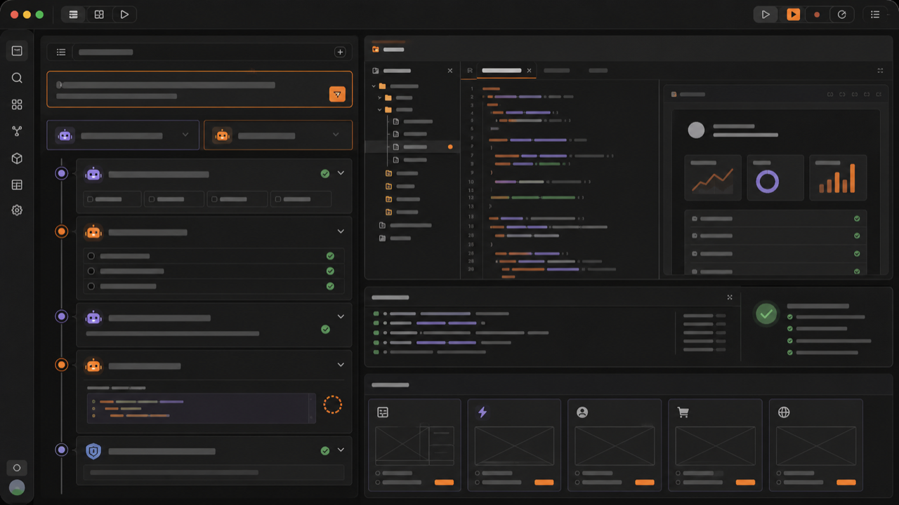

[← zuuzii](https://github.com/zuuzii-org) · [Website ↗](https://zuuzii.com) · **English** · [中文](agentstudio.zh.md)

# 🤖 AgentStudio

**Describe it, two agents build it.**

---

## In one sentence

**AgentStudio is a no-code macOS workbench where you describe what you want in plain language, and two AI agents — a planner and a builder — collaborate and iterate until a working result actually runs on your Mac.**

No syntax. No setup rabbit holes. No "almost works." You talk, they build, it ships.

---

## How the two-agent loop works

Most AI tools hand you a single model that guesses once and hopes. AgentStudio runs a **two-agent loop** instead — a planner and a builder that pass work back and forth, the same way a senior engineer hands a blueprint to a maker and reviews what comes back. Here is the whole cycle, step by step.

### 1 · You describe it

You type what you have in mind, in everyday words. _"A tool that renames my photos by date." "An app that tracks my workouts." "Something that turns this folder of CSVs into one clean spreadsheet."_ No flowcharts, no requirements doc, no jargon. If you can explain it to a friend, you can describe it to AgentStudio.

### 2 · The planner maps it

The first agent — the **planner** — reads your request and breaks it into a real plan: what the thing needs to do, which pieces it requires, and the order to build them in. It turns a fuzzy wish into a concrete blueprint, so nothing gets built on a guess. This is the step that separates "AI that autocompletes" from "AI that actually understands the goal."

### 3 · The builder makes it — and checks itself

The second agent — the **builder** — takes that blueprint and constructs the real thing. Then it does what most AI never bothers to: it **runs its own work and inspects the result.** Did it execute? Did it do what the plan asked? The builder grades its own output before you ever see it, catching the broken pieces a one-shot generator would have shipped straight to you.

### 4 · It loops until it runs

When the builder finds a flaw, it doesn't shrug — it **loops back.** Plan, build, self-check, fix, repeat. The two agents keep cycling until the result genuinely runs on your macOS machine. You're not handed a hopeful draft; you're handed something that works. That closed feedback loop is the whole point: **AgentStudio iterates so you don't have to debug.**

---

## What people build with it

AgentStudio is built for **people with ideas, not credentials** — the non-coder who's tired of waiting on someone else, and the tinkerer who wants to move at the speed of their own curiosity. A few of the things that come to life here:

- **Personal automations** — rename, sort, and reorganize files; batch-convert images; clean up messy folders without touching the command line.
- **Tiny everyday apps** — a habit tracker, a reading list, a budget tool, a countdown for the thing you actually care about.
- **Data wranglers** — merge spreadsheets, scrape a list into a tidy table, turn raw exports into something readable.
- **Workflow helpers** — small utilities that take one annoying manual chore off your plate, every single day.
- **"I wonder if I could…" experiments** — the half-formed idea you'd never hire a developer for, now a weekend afternoon away from being real.

If it's the kind of small, useful software you wish existed but never had the time or skills to make — **this is the workbench for it.**

---

## Before you build

Do I need to know how to code?
 No. That's the entire point. You describe the result in plain language and the two agents handle the planning and building. AgentStudio is a no-code tool designed specifically for non-coders and tinkerers.

What makes this different from a regular AI chatbot?
 A chatbot generates one answer and stops. AgentStudio runs a two-agent loop — a planner and a builder — where the builder runs and checks its own work, then loops back to fix what's broken. It keeps iterating until the result actually runs, instead of handing you a draft that "should" work.

Where does it run?
 It's a native macOS app that runs locally on your Mac. You work in a real desktop workbench, not a browser tab.

What can I actually make with it?
 Small, useful software: personal automations, tiny apps like trackers and budget tools, data cleanup utilities, and workflow helpers. If you can describe it in a sentence, it's a candidate.

What if the first result isn't right?
 That's expected — and it's exactly what the loop is for. The builder self-checks and the agents keep iterating until something works. You can also describe what you'd like changed, and the loop runs again.

Is it really self-checking, or do I have to test everything?
 The builder runs its own output and inspects whether it executes and matches the plan before you see it. You stay in control of what you want, but you're not the one hunting for bugs.

AgentStudio is a local macOS application. Results depend on what you describe; the two-agent planner-builder loop iterates toward a working outcome but the clearer your description, the faster it gets there.

**Keywords** · no-code macOS app, two AI agents, AI app builder for non-coders, plain language app builder, planner and builder agents, self-checking AI, local macOS workbench, build apps without coding, AI automation tool, iterate until it runs

---

Part of **[zuuzii](https://github.com/zuuzii-org)** · [zuuzii.com](https://zuuzii.com) · hi@zuuzii.com
