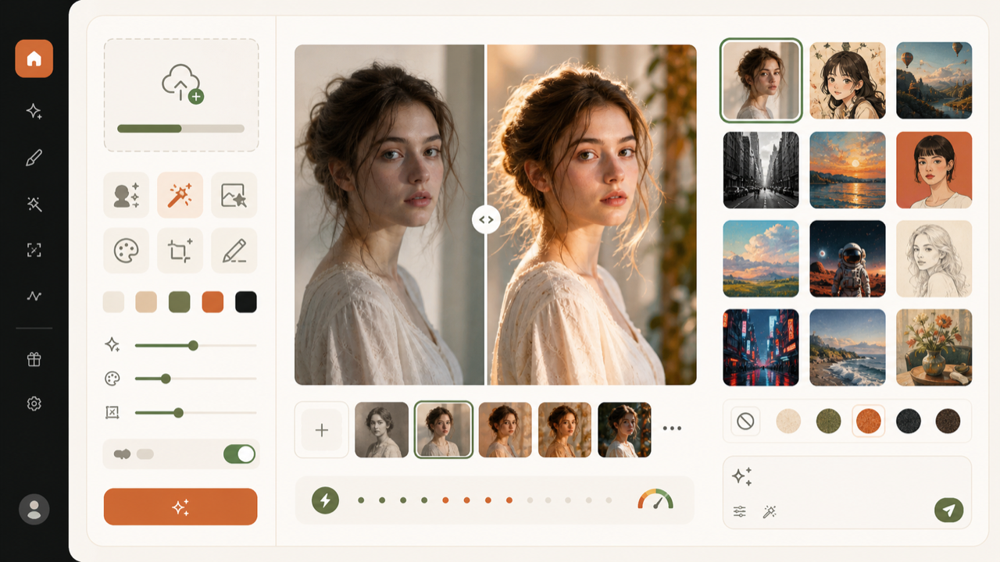
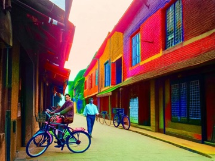

[← zuuzii](https://github.com/zuuzii-org) · [Website ↗](https://zuuzii.com) · **English** · [中文](ai-warmup.zh.md)

# 🎨 AI Warmup

**Upload a photo, let AI reimagine it.**

---

## What it is

An online AI image studio. Upload a photo and AI will restyle, edit, restore, or repaint it — metered in points, generated on the spot, entirely in your browser.

## Why it exists

Powerful image models are scattered across heavy tools and clunky setups. AI Warmup puts the common moves — restyle, restore, repaint — one upload away.

## Features

- **Restyle, edit, restore, repaint** any image
- **Point-metered** — pay for what you use
- **Instant generation**, right in the browser
- **Nothing to install**

## Who it's for

- Quick image creation and experiments
- Portrait restyling and old-photo restoration

## FAQ

Do I need to install anything?
 No — it runs in the browser.

How is it billed?
 By points, generated on the spot.

## Examples

<table>
<tr>
<td width="50%" align="center"> Portrait restyle</td>
<td width="50%" align="center"> Style transfer (oil)</td>
</tr>
<tr>
<td width="50%" align="center"> Photo restore</td>
<td width="50%" align="center"> Colorize</td>
</tr>
</table>

---

Part of **[zuuzii](https://github.com/zuuzii-org)** · [zuuzii.com](https://zuuzii.com) · hi@zuuzii.com
