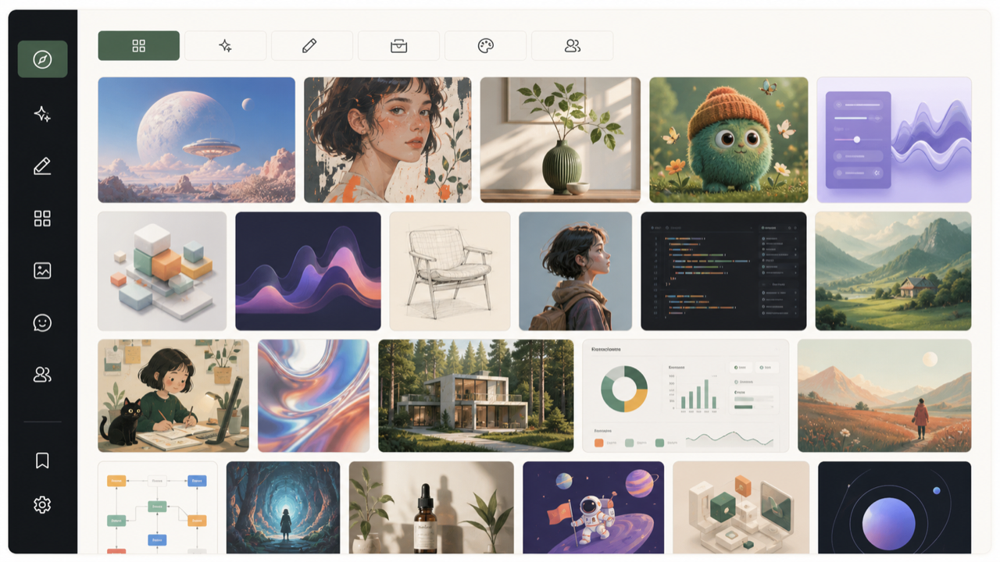

[← zuuzii](https://github.com/zuuzii-org) · [Website ↗](https://zuuzii.com) · **English** · [中文](aihunter.zh.md)

# 🧭 AI Tools Library

**Fresh AI tools, hand-picked daily.**

---

## The Curation Desk

**AI Tools Library is a hand-picked, daily-updated web directory of AI tools, organized by what you are trying to get done — writing, image, video, code, audio, and productivity.** That is the whole pitch, and the whole position: in a market that ships a hundred new AI tools before lunch, the scarce resource is not *more* — it is _judgment_. Anyone can scrape a feed and call it a directory. We do the opposite. We sit at the desk, we try the things, and we publish a tight, opinionated shortlist so you can stop doom-scrolling launch pages and start building.

The exhaustive list is a graveyard. The curated list is a map. We picked the map.

## How the List Gets Made

A directory is only as good as the taste behind it. Here is the bar an entry has to clear before it earns a spot.

- **Daily passes, not a one-time dump.** The library is reviewed and refreshed every day. New launches get vetted, dead links get pulled, and tools that quietly went stale lose their place.
- **Hand-picked, not auto-ingested.** Every tool is reviewed by a human before it goes live. No firehose, no SEO-spam clones padding the count.
- **Quality over coverage.** We would rather list the three image tools actually worth your afternoon than forty that look the same. Comprehensiveness is easy and useless; a strong shortlist is hard and valuable.
- **Written for a decision, not for a brochure.** Each entry tells you _what it does_, _who it is for_, and gives you a _direct link_ — no signup wall, no maze, no "request a demo" before you can see the thing.

If a tool cannot survive that, it does not make the cut. That is the entire point.

## Browse By What You Are Actually Doing

You did not wake up wanting "an AI tool." You woke up needing to ship a draft, cut a video, or unstick a function. So the library is sorted by the job, not by hype. Pick your lane.

| You're working on | The shelf to open |
| --- | --- |
| **Writing** | Drafting, editing, copy, long-form, and ghostwriting assistants |
| **Image** | Generators, editors, upscalers, and design helpers |
| **Video** | Generation, editing, captions, and avatar tools |
| **Code** | Copilots, reviewers, agents, and shipping tools for builders |
| **Audio** | Voice, music, transcription, and cleanup |
| **Productivity** | Search, automation, notes, and the workflow glue |

Know the job, open the shelf, grab the tool, get back to work.

## This Week On The Board

Every week we put up a **board of what is new and what is trending** — the launches worth a second look and the tools quietly catching fire across the AI crowd. Think of it as the front page of the desk: a fast, scannable read on where the momentum is this week, so you stay current without subscribing to twelve newsletters and following a hundred threads. It is how the people who keep up with AI actually keep up — and it is free to read.

The board moves because the field moves. Check in weekly, leave knowing what changed.

## A Few Honest Questions

Is it free to browse?
 Yes. Browsing the library, the categories, and the weekly board costs nothing. No account required to look around.

Why not just list every AI tool out there?
 Because an exhaustive list is noise. The value of a curated directory is everything we leave _out_. We aim for the shortlist you would trust a sharp friend to give you, not a wall of every product with a landing page.

How often is it updated?
 Daily. The library is reviewed and refreshed every day, and the trending board turns over weekly.

Who is this for?
 Two crowds: people who want to keep up with AI without drowning in it, and builders hunting for the right tool for a specific job — fast.

How is a tool chosen?
 A human reviews it against a quality bar before it is listed. We weigh whether it actually works, who it genuinely helps, and whether it earns a spot over what is already on the shelf.

What does each listing tell me?
 What the tool does, who it is for, and a direct link to try it. Enough to decide in seconds, nothing you have to dig for.

Hand-picked and updated daily. We curate so you do not have to scroll. Free to browse.

**Keywords** · AI tools directory, curated AI tools, daily updated AI tools, best AI tools by category, AI tools for writing image video code audio productivity, trending AI tools weekly, hand-picked AI tool library, find AI tools, new AI tool launches, AI tool discovery

---

Part of **[zuuzii](https://github.com/zuuzii-org)** · [zuuzii.com](https://zuuzii.com) · hi@zuuzii.com
