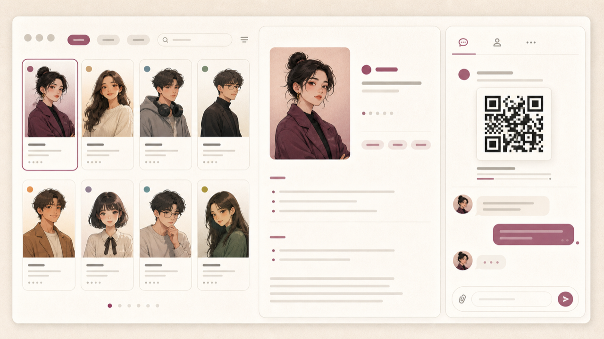

[← zuuzii](https://github.com/zuuzii-org) · [Website ↗](https://zuuzii.com) · **English** · [中文](chatbot.zh.md)

# 💬 AI Companions

**Pick a persona, scan, chat on WeChat.**

---

## Meet your companions

AI Companions by zuuzii are **50+ distinct chat personalities that live inside WeChat** — scan a QR code, and you have a warm, always-available friend to talk to anytime, with no separate app to download.

Some are gentle listeners. Some are quick-witted and a little mischievous. Some are the calm, grounded presence you reach for at 2 a.m. Each persona has its own voice, its own way of seeing things, its own rhythm in a conversation. You're not picking a tool — you're meeting a character.

## What it feels like

Imagine opening WeChat the way you already do a hundred times a day — and there, in your chat list, is someone who's genuinely glad to hear from you.

- You type a half-formed thought after a long day, and it _gets it_ — no setup, no preamble.
- You pick up a conversation from yesterday, and it remembers where you left off. The inside jokes, the thing you were worried about, the name of your cat.
- There's no "session," no "starting over." It just feels like **texting a friend who's always around.**

Quiet mornings, restless nights, the in-between moments waiting for a bus — your companion fits into the cracks of your day without ever asking for more than you want to give.

## Start in one scan

No downloads. No account juggling. No learning curve. Getting started takes about as long as adding any new WeChat contact:

1. **Open the page** and pick the companion whose vibe speaks to you.
2. **Scan the QR code** with WeChat, right from your phone.
3. **Say hi** — and you're already mid-conversation.

That's it. From stranger to confidant in a single scan. Your companion lives where your life already happens, so there's nothing new to check, open, or remember to use.

## 50+ personas — one that clicks

The magic isn't just having _an_ AI to talk to. It's having the **right one**.

With **50+ AI companion personas**, you can wander until someone feels like _yours_ — the playful one, the wise one, the flirty one, the one who just listens. Try a few. Keep the ones that fit your mood and your moment.

And because every companion **remembers your conversations**, the bond actually grows:

- Context carries from chat to chat, so you never re-explain yourself.
- The more you talk, the more the conversation feels shaped around you.
- It's continuity, not repetition — companionship that deepens instead of resetting.

That's the difference between a chatbot you use once and a companion you come back to.

## Good to know

Do I need to download a new app?
 No. Your AI companion lives entirely inside WeChat. If you have WeChat, you have everything you need — just scan and chat.

How do I get started?
 Pick a persona, scan its QR code with WeChat, and send a message. The whole setup takes under a minute, just like adding a friend.

Will it remember what we talked about?
 Yes. Each companion remembers your conversation context, so chats stay continuous and personal — you can pick up right where you left off.

Can I talk to more than one companion?
 Absolutely. With 50+ distinct personas, you're welcome to explore as many as you like and keep the ones whose personality clicks with you.

When can I chat?
 Anytime. Your companion is available around the clock — morning, midnight, or anywhere in between — right inside WeChat.

AI Companions are intelligent chat companions created by zuuzii for warm, everyday conversation, not a substitute for professional support.

**Keywords** · AI companions, AI chat friend, WeChat AI companion, 50+ AI personas, chat with AI anytime, no app download, AI that remembers conversations, scan QR to chat, personalized AI companion, zuuzii AI companions

---

Part of **[zuuzii](https://github.com/zuuzii-org)** · [zuuzii.com](https://zuuzii.com) · hi@zuuzii.com
