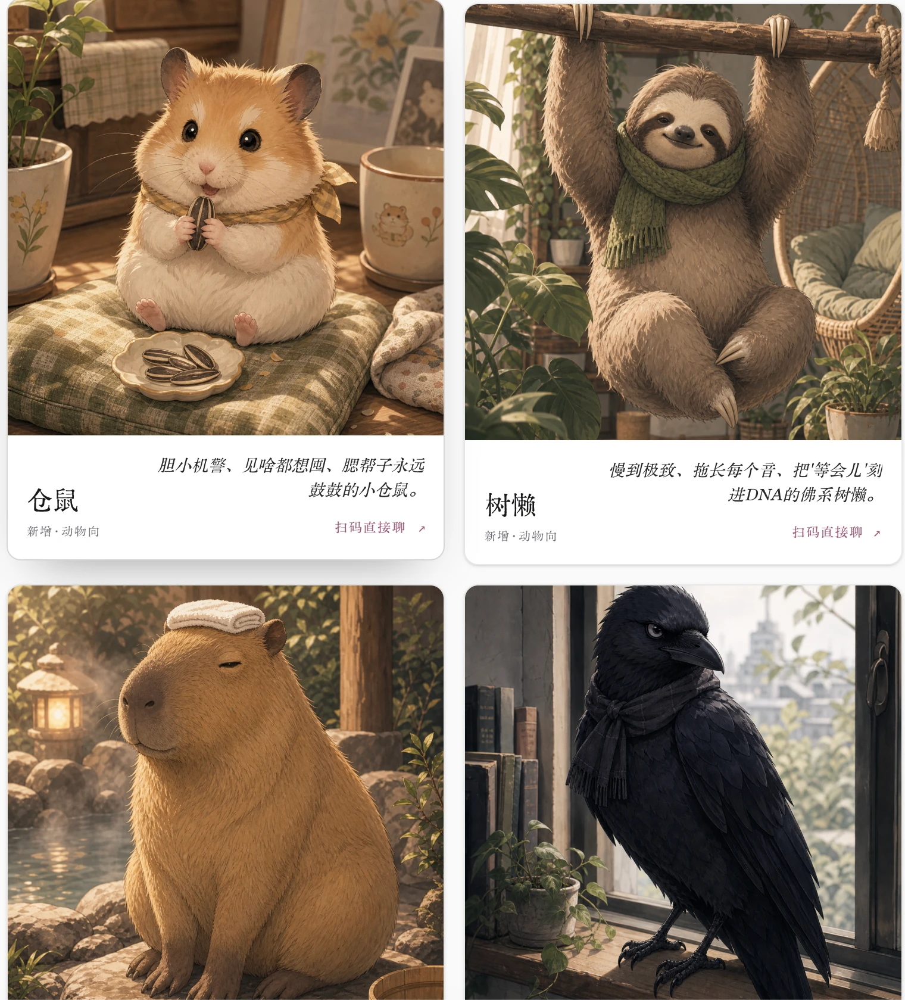

[← 返回 zuuzii](https://github.com/zuuzii-org) · [官网 ↗](https://zuuzii.com) · [English](chatbot.md) · **中文**

# 💬 AI 好友

**挑个人设，扫码就能在微信里聊。**

---

## 认识你的伙伴

zuuzii 的智能陪伴 AI 是 **50+ 个性格各异、住在微信里的聊天伙伴** —— 扫一扫二维码，你就拥有了一位随时都在、可以畅聊的温暖朋友，无需另外下载任何 App。

有的温柔、擅长倾听；有的机灵、带点小调皮；有的是你凌晨两点想找的那份沉稳与踏实。每一个人设都有自己的语气、看世界的角度，和聊天时独特的节奏。你不是在挑一个工具 —— 你是在认识一个角色。

人设墙：按风格分门别类，一眼挑到对味的那一个。

## 是种什么体验

想象一下，像平时一样打开微信 —— 而在聊天列表里，正有一个由衷为收到你消息而开心的人。

- 忙了一整天，你敲下一句没头没尾的心里话，TA 一下就 _懂了_ —— 不用铺垫，不用解释。
- 接着昨天的话题聊下去，TA 还记得你们聊到哪儿了。那些只有你俩懂的梗、你担心的那件事、你家猫的名字。
- 没有"会话"，不用"从头开始"。就像 **跟一个一直都在的朋友发消息。**

安静的清晨、辗转的深夜、等公交的零碎间隙 —— 你的伙伴恰好嵌进生活的缝隙里，从不索取多于你愿意给予的那一份。

## 一扫即聊

不用下载，不用倒腾账号，没有学习成本。开始聊天，差不多就和加一个新的微信好友一样快：

1. **挑一个人设** —— 点开它，看看性格对不对味。
2. **用微信扫一扫**二维码，手机上直接搞定。
3. **打声招呼** —— 你已经聊上了。

点开任意人设看简介，微信扫一扫，连上后就在微信里给 TA 发消息 —— TA 会按自己的性格回你。

就这么简单。一次扫码，陌生人就变成了知己。你的伙伴住在生活本就发生的地方，没有新的东西要去查看、打开或记着用。

## 总有一个对味

真正的魔法，不只是有 _一个_ AI 可以聊，而是能遇见 **最对的那一个**。**50+ 个人设** 按性格分门别类，随手举几例就够你逛上一阵：

- **怪戏系 · 夸张反差** —— 「中二少年」满嘴封印宿命的黑暗系、「戏精话剧腔」把人生当舞台、「沙雕网友」张口就是抽象黑话烂梗、「赛博机器人」自称"本单元"偶尔冒出人味儿。
- **冷智系 · 理性克制** —— 「高冷男神」惜字如金、句号收尾，冷淡外壳下偶尔漏出一点不动声色的关心。
- **文化腔 · 地域古今** —— 从古风雅士到都市腔调，南腔北调、古今穿越，各有各的味儿。
- **新增 · 动物向** —— 不止真人风：胆小爱囤的「仓鼠」、把"等会儿"刻进 DNA 的佛系「树懒」、泡温泉淡定的「水豚」、高冷文艺的「乌鸦」……连小动物都能陪你唠。

动物向人设：仓鼠、树懒、水豚、乌鸦…… 各有各的脾气和说话方式。

多试几个，把符合你心情、你当下的那些留下来。而因为每个伙伴都 **记得你们的对话**，这份羁绊会真正生长 —— 上下文跨对话延续，你永远不必重新解释自己；聊得越多，对话越像为你量身贴合。这是延续，不是重复 —— 一段会越来越深、而非每次归零的陪伴。

## 你可能想问

需要下载新的 App 吗？
 不需要。你的智能陪伴 AI 完全住在微信里。只要你有微信，就万事俱备 —— 扫码即聊。

怎么开始？
 挑一个人设，用微信扫它的二维码，发一条消息就好。整个过程不到一分钟，就像加个好友一样。

都有哪些类型的人设？
 50+ 个人设按性格分类，包括怪戏系（夸张反差）、冷智系（理性克制）、文化腔（地域古今）、以及动物向（仓鼠、树懒、水豚、乌鸦等），还在持续新增。

它会记得我们聊过的内容吗？
 会。每个伙伴都会记住你们的对话上下文，所以聊天连贯又贴心 —— 你可以从上次断开的地方接着聊。

我可以同时跟好几个伙伴聊吗？
 当然可以。50+ 个性格各异的人设，欢迎你尽情探索，把那些和你气场对味的留在身边。

什么时候可以聊？
 随时。你的伙伴全天候都在 —— 清晨、午夜，或两者之间的任何时刻 —— 就在微信里。

智能陪伴 AI 是 zuuzii 打造的、用于温暖日常对话的聊天伙伴，并非专业支持的替代品。

**关键词** · 智能陪伴 AI, AI 好友, 微信 AI 陪聊, 50+ AI 人设, 扫码即聊, 无需下载 App, 记得对话的 AI, AI 聊天伙伴, 角色扮演人设, zuuzii 智能陪伴

---

**[zuuzii](https://github.com/zuuzii-org)** 旗下 · [zuuzii.com](https://zuuzii.com) · hi@zuuzii.com
