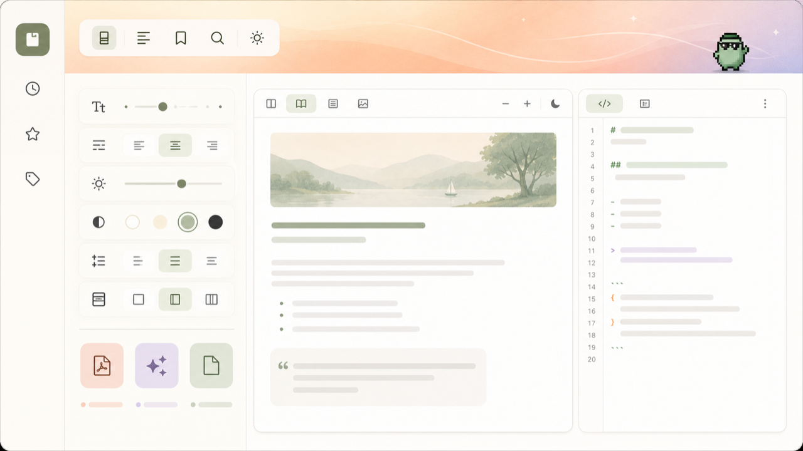

[← 返回 zuuzii](https://github.com/zuuzii-org) · [官网 ↗](https://zuuzii.com) · [English](museview.md) · **中文**

# 📖 MuseView

**本地优先的 Markdown / HTML 阅读器。**

---

## 这是什么

MuseView 是一款 iOS 上的本地优先 Markdown 与 HTML 阅读应用,所有文件始终保存在你的设备上。它能忠实渲染 Markdown 和 HTML,支持实时预览与行内编辑,可一键导出为干净、可打印的 PDF,并仅在你主动请求时生成 AI 摘要。它专为重度阅读者、笔记达人与研究者打造,是你成堆 .md 与 .html 文件的私密、离线优先之家。

## 为什么做它

大多数 Markdown 应用都会悄悄把你的笔记推上别人的云端,把私密阅读变成一条被同步、被扫描、被变现的数据流。MuseView 为想要相反体验的人而生:一个快速、优雅的阅读器,文件默认留在设备上,除非你开口,什么都不会外传。它化解了"现代功能"与"真正隐私"之间的矛盾——忠实渲染、行内编辑、PDF 导出与可选 AI,一应俱全,却不必交出对文档的所有权。

## 功能特性

- **本地优先隐私** — 你的 Markdown 与 HTML 文件默认留在设备上,没有强制云端、没有静默同步,除非你明确选择,任何内容都不会离开你的 iPhone。
- **忠实渲染** — Markdown 与 HTML 完全按原文呈现,标题、代码块、表格、链接与样式每一次都干净、准确,忠于源文件。
- **实时预览编辑** — 行内编辑的同时,格式化预览实时刷新,把写作与阅读融为一片顺滑的同一界面。
- **可打印 PDF 导出** — 轻点一下,即可把任意 Markdown 或 HTML 文档转为清晰、专业、可直接打印的 PDF,分享、归档、交付皆宜。
- **按需 AI 摘要** — 只在你需要时请求 AI 摘要;只要你不开口,所有阅读与编辑都完全在本地、保持私密。
- **离线随时可读** — 在飞机上、隧道里、信号之外,都能打开、阅读、编辑你的文库——MuseView 从不需要联网就能显示你的文件。
- **为海量文库而生** — 在一个从容、快速的阅读器里驯服整片 .md 与 .html 文件夹,专为以百计、而非以个计数笔记的人设计。

## 使用场景

- 用它在 iPhone 上阅读和复盘成堆的 .md 笔记,而无需上传任何一个文件到云端。
- 用它快速对 Markdown 草稿进行行内修改,边打字边看实时预览刷新。
- 用它把研究笔记或文档导出为干净、可打印的 PDF,用于分享或提交。
- 用它在完全离线时打开并忠实渲染 HTML 文档与 Markdown 文章。
- 用它在真正需要要点时,才按需生成一篇长文档的 AI 摘要。

## 适合谁

- 在路上大量阅读长篇 Markdown 与 HTML、并希望排版正确的重度阅读者。
- 坐拥成堆 .md 文件、需要阅读、编辑与导出的笔记达人与研究者。
- 拒绝强制云同步、希望文档留在设备上的注重隐私的用户。
- 需要把 Markdown 草稿变成精致、可打印 PDF 的写作者与学生。
- 想要可选 AI 摘要、又不愿放弃本地离线掌控权的知识工作者。

## 为什么选它

当隐私不容妥协、你又不愿放弃现代功能时,就选 MuseView。与那些默认把笔记同步到远程服务器的云优先 Markdown 编辑器不同,MuseView 让每个文件都留在设备上,并把 AI 设为按需开启、而非常驻运行。它最适合那些想在一个私密、离线优先的 iOS 应用里同时获得忠实 Markdown/HTML 渲染、行内编辑与干净 PDF 导出的阅读者与研究者——一款默认本地、仅在你请求时才智能的稀有阅读器。

## 常见问题

MuseView 是本地优先应用吗?我的文件会保持私密吗?
 是的。MuseView 从设计上就是本地优先:你的 Markdown 与 HTML 文件默认留在 iOS 设备上,没有强制云端,除非你明确选择,任何内容都不会离开应用。

MuseView 能阅读和渲染哪些文件格式?
 MuseView 能忠实地阅读并渲染 Markdown(.md)与 HTML 文档,标题、代码块、表格、链接与样式都忠于源文件呈现。

在 MuseView 里能编辑 Markdown,还是只能阅读?
 可以编辑。MuseView 支持带实时预览的行内编辑,你可以一边修改,一边在同一屏幕上看格式化结果实时刷新。

MuseView 能把 Markdown 导出为 PDF 吗?
 可以。MuseView 能轻点一下就把任意 Markdown 或 HTML 文档导出为干净、可打印的 PDF,非常适合分享、归档或打印。

MuseView 用 AI 吗?我的阅读内容会被发到云端吗?
 MuseView 提供严格按需的 AI 摘要,只在你主动请求时才运行;否则所有阅读与编辑都在本地进行,因此 AI 是按需开启,而非常驻运行。

MuseView 能离线使用吗?
 可以。由于文件存储在设备上,你可以完全离线地打开、阅读、渲染和编辑整个文库,无需任何网络连接。

MuseView 最适合谁?
 MuseView 最适合坐拥成堆 .md 与 .html 文件、希望在 iOS 上获得忠实渲染、本地私密存储与干净 PDF 导出的重度阅读者、笔记达人与研究者。

**关键词** · 本地优先 Markdown 阅读器 iOS, Markdown HTML 阅读应用, Markdown 导出 PDF, 私密文档阅读器, 离线 Markdown 应用, 设备本地 Markdown 编辑器, iOS Markdown 查看器, AI 文档摘要应用

---

**[zuuzii](https://github.com/zuuzii-org)** 旗下 · [zuuzii.com](https://zuuzii.com) · hi@zuuzii.com
