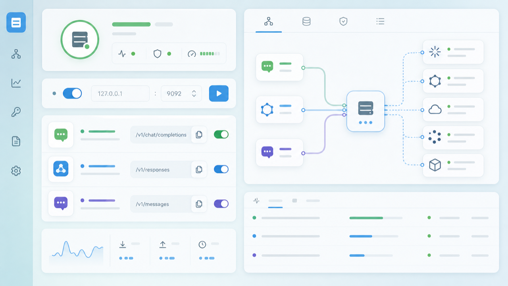
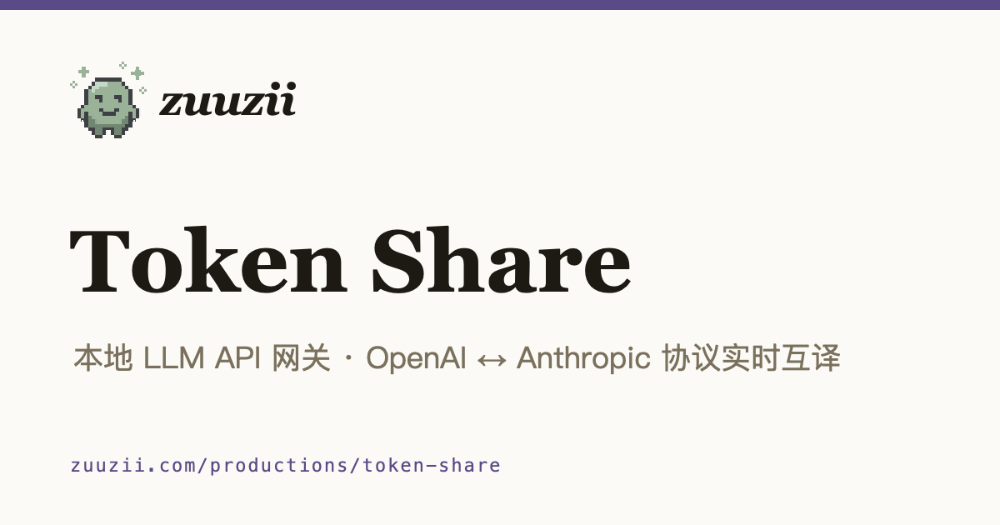

[← zuuzii](https://github.com/zuuzii-org) · [Website ↗](https://zuuzii.com) · **English** · [中文](token-share.zh.md)

# 🔀 Token Share

**Local gateway — any client, any model.**

---

## TL;DR

**Token Share is a fully local LLM API gateway that exposes one endpoint, translates between the OpenAI and Anthropic protocols in real time, and lets any client talk to any provider or model — without your API keys ever leaving your machine.**

Point your tools at `localhost`. Token Share does the rest.

## The problem

Every client speaks one dialect. Every provider speaks another. Your editor wants OpenAI-shaped requests; the model you actually want to use speaks Anthropic — or vice versa. So you end up maintaining a drawer full of adapters, shims, and brittle proxy scripts, re-keying credentials into five different config files, and praying nothing leaks. Switching models means switching tools. Switching tools means re-wiring everything.

Token Share collapses that mess into a single local hop.

## Before / After

| Without Token Share | With Token Share |
| --- | --- |
| Each client locked to one provider's protocol | One endpoint speaks both OpenAI and Anthropic |
| API keys pasted into every app's config | Keys live in one place, never leave the machine |
| Swap models → re-wire the client | Swap models → change one line |
| Protocol mismatch = dead integration | Real-time translation bridges the gap |
| Streaming breaks across adapters | Streaming preserved end-to-end |

## Capabilities

- **Protocol translation, live.** OpenAI ⇄ Anthropic request and response shapes converted on the fly — no batching, no buffering theater.
- **One endpoint, every client.** Point editors, CLIs, scripts, and agents at the same local URL.
- **Provider-agnostic routing.** Any client reaches any supported provider or model behind the gateway.
- **End-to-end streaming.** Token-by-token output flows through the translation layer intact.
- **Local-first by design.** The gateway runs on your machine; credentials and traffic stay there.
- **Zero lock-in.** Change models or providers without touching your client setup.

## Specs at a glance

| | |
| --- | --- |
| **Protocols** | OpenAI ⇄ Anthropic, translated in real time |
| **Clients** | Any OpenAI- or Anthropic-compatible tool |
| **Streaming** | Supported end-to-end |
| **Hosting** | Fully local — runs on your machine |
| **API keys** | Never leave the local machine |
| **Audience** | Developers juggling multiple models and clients |

## Questions developers actually ask

Do my API keys ever leave my machine?
 No. The gateway is fully local. Keys are stored and used on your machine, and traffic routes through your own process — nothing is shipped to a third-party relay.

Can an OpenAI-only client use an Anthropic model?
 Yes — that's the point. Token Share translates between the two protocols in real time, so a client that only speaks OpenAI can reach an Anthropic model, and vice versa.

Does streaming still work through the gateway?
 Yes. Streaming is preserved end-to-end. Tokens flow through the translation layer as they arrive, not after the full response lands.

What do I change in my client?
 The base URL. Point it at the local Token Share endpoint instead of the provider's. Most OpenAI- or Anthropic-compatible tools need nothing more.

Can I switch models without reconfiguring everything?
 Yes. Because clients only ever talk to the one local endpoint, swapping the underlying provider or model doesn't ripple back into your tools.

Token Share is a local LLM API gateway and protocol bridge for developers. It does not store your traffic or transmit your API keys off-device.

**Keywords** · local LLM API gateway, OpenAI Anthropic protocol translation, LLM proxy localhost, API key privacy local, multi-model client routing, streaming LLM gateway, developer LLM tooling, switch models without reconfiguring

---

Part of **[zuuzii](https://github.com/zuuzii-org)** · [zuuzii.com](https://zuuzii.com) · hi@zuuzii.com
