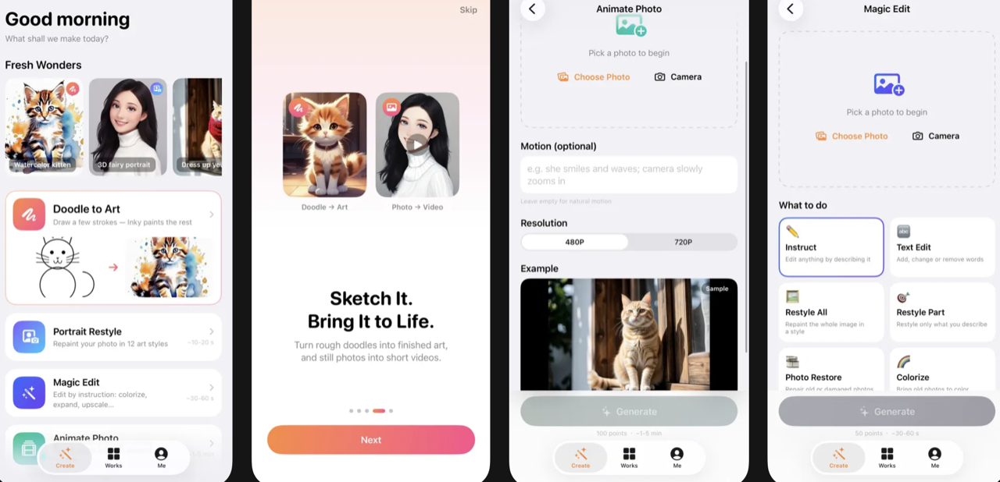

[← zuuzii](https://github.com/zuuzii-org) · [App Store ↗](https://apps.apple.com/app/id6779648706) · **English** · [中文](wonderink.zh.md)

# 🪄 WonderInk

**Restyle, doodle, animate — four AI creation tools in your pocket.**

> 📲 **[Tap to download WonderInk on the App Store →](https://apps.apple.com/app/id6779648706)** — free on iPhone.

---

## What WonderInk is

WonderInk is a free iOS app that turns your photos and doodles into AI artwork and short videos — **four creation tools in one studio**: portrait restyle, smart photo edit, doodle-to-art, and photo-to-video. Every finished piece stays in your library on the device.

## Four tools, one studio

### 🖼️ Portrait Restyle

Turn one photo into a whole new you, in **12 art styles** — 3D fairytale, anime, classical Chinese ink, retro comic, and more. It's the fastest tool in the app: a restyle comes back in about five seconds.

> **How to use** — pick a photo → tap a style from the 12-style grid → **Generate**.

### ✨ Smart Edit

Edit a photo just by telling it what you want. One tool, **seven one-tap functions**: instruction edit, whole-image restyle, black-and-white colorize, text & watermark removal, smart expand (outpaint beyond the frame), and super-resolution upscale.

> **How to use** — pick a photo → choose a function → set its options (a prompt, an aspect ratio, or an upscale factor) → **Generate**.

### ✏️ Doodle to Art

Sketch a few rough strokes, describe what you meant, and AI finishes it into a complete piece. The canvas has pen, eraser, adjustable thickness, undo, and clear.

> **How to use** — draw on the canvas → add a description and pick a style chip → **Generate**.

### 🎬 Photo to Video

Bring a still photo to life as a **5-second clip** with automatic camera motion, in 480p or 720p — perfect for a living wallpaper or a share-worthy moment.

> **How to use** — pick a photo → add an optional description → choose 480p/720p → **Generate** (keep the app in the foreground while it renders).

## How to get started

1. **Open the Create tab** — four tool cards greet you, each with its own color.
2. **Tap a tool** and pick a photo from your library (or start drawing, for Doodle).
3. **Set your options and tap Generate.** The first time, a quick privacy notice tells you exactly what's sent.
4. **Save or share the result** — every piece lands in your **Works** tab, a local gallery you can replay, save, or delete anytime.

No sign-in required to try it — start in guest mode, or sign in with Apple, Google, or email to keep your works across devices.

## Your works stay on your device

WonderInk keeps your finished pieces **locally**, in the Works gallery — there's no cloud library to manage. Photos you upload are used **only to fulfill the generation**, never for training, ads, or tracking; only your most recent generations are retained and then auto-deleted. Nothing leaves your phone unless you choose to share it.

## FAQ

What is WonderInk?
 WonderInk is a free iOS app that turns photos and doodles into AI art and short videos, with four tools in one: portrait restyle, smart photo edit, doodle-to-art, and photo-to-video.

How much does it cost?
 WonderInk is free to download on the App Store.

Which devices does it run on?
 It's an iOS app for iPhone — download it from the App Store.

How long does a generation take?
 A portrait restyle comes back in about 5 seconds; smart edits and doodles take roughly 30–60 seconds; a photo-to-video clip takes about 1–5 minutes.

Where are my photos stored?
 Your finished works are saved locally on your device. Uploaded photos are used only to generate the result and are then auto-deleted — never used for training, ads, or tracking.

Do I need an account?
 No — you can start in guest mode. Signing in with Apple, Google, or email is optional and lets you keep your works.

WonderInk is an AI image & video creation app by zuuzii. Results depend on your input; uploaded content is used only to fulfill your request.

**Keywords** · AI art app iPhone, AI portrait restyle, anime photo filter, AI photo editor iOS, colorize photo app, AI doodle to art, sketch to image, photo to video AI, animate photo app, WonderInk

---

Part of **[zuuzii](https://github.com/zuuzii-org)** · [zuuzii.com](https://zuuzii.com) · hi@zuuzii.com
